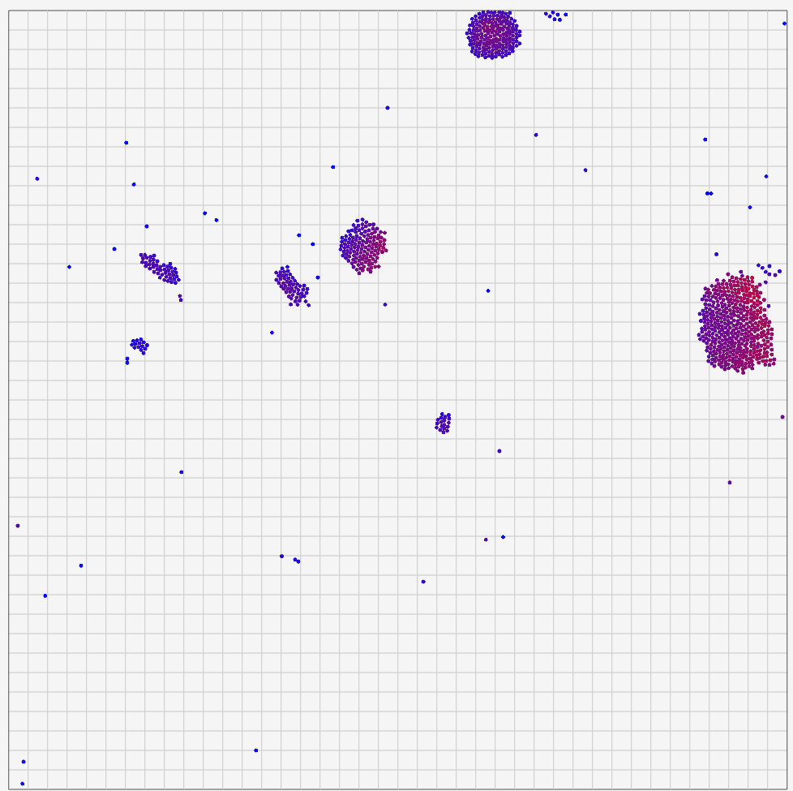

# C++ N-Body Simulation
This N-Body Simulation is compiled in C++ and Raylib. 

Feel free to use this repo for your own use.

## Features
- Adjustable simulation bounds by modifying `minX`, `maxX`, `minY`, and `maxY` variables in the source code.
- Dynamic visuals with color-coded particles representing energy levels (blue to red), grid overlays, and a contrasting UI.
- Inelastic collisions (modifiable via code)
- Spawn particles in-game with velocities and directions of your choosing
- Adjustable number of particles to spawn on start
- In-game gravity manipulation
- 




# Controls

### Particle Interaction
- Left click anywhere to spawn a particle.
- Left click and drag to spawn a particle with a direction and velocity.

### Camera Controls
- Hold right click to pan the camera.
- You can also use the arrow keys to pan the camera.
- Use the scroll wheel to zoom in and out with the camera.

### Simulation Adjustments
- The '[' button halves Gravity while ']' doubles it.
- Press C to toggle collisions.
- Press P to toggle whether or not you want to automatically spawn particles on start/restart.
- Press R to restart the simulation.

### Exit

- Esc button to leave the game.

# Important notes

- This project does NOT use the Barnes-Hut model.
- This is an amateur project.
- Particles in the center of large<sup>[1]</sup> clumps may exhibit instability due to unoptimized handling of extreme interactions. This is a known limitation and may be addressed in future updates.

<sup>[1]</sup> Smaller clumps collide perfectly correctly.

# Future Improvements

This is a todo list of improvements I am planning on implementing as the project grows.

- [ ] Barnes-Hut model (Allowing for millions of particles)
- [ ] Better parameter adjustment UI
- [x] Coloured controls in UI for readability and accessibility
- [x] Multi threading support (currently very terribly implemented)
- [ ] Sound effects on collision
- [ ] Background music?
- [ ] Individual particle manipulation
- [ ] Web export
- [ ] MacOS/Linux export

# How to compile

## For VSCode

This project contains a .vscode folder with configurations. Just make sure that you have Raylib and g++ (a C++ compiler) properly installed. Also, add this code to your `.vscode/c_cpp_properties.json` file, create it if it doesn't exist:

```
{
    "configurations": [
        {
            "name": "Win32",
            "includePath": [
                "${workspaceFolder}/**",
                "C://raylib/raylib/src"
            ],
            "defines": [
                "_DEBUG",
                "UNICODE",
                "_UNICODE"
            ],
            "windowsSdkVersion": "10.0.22000.0",
            "compilerPath": "cl.exe",
            "cStandard": "c17",
            "cppStandard": "c++17",
            "intelliSenseMode": "windows-msvc-x64"
        }
    ],
    "version": 4
}
```
Also, these directions assume you have everything installed in the default location.

## For Notepad++

### If you use Raylib's given Notepad++
You can find Raylib's Notepad++ inside of the raylib installation directory. Then you can find `notepad++.exe` under the `npp` folder.

#### Steps
1. Open main.cpp (with Raylib's version of NP++) 
2. Press f6 
3. You'll see a list of commands. One of them should be `SET CC=gcc`. Replace `gcc` with `g++`. If it's already like that, continue to the next step.
4. Click on 'OK'.
5. You're done!

#### Notes
- `gcc` must be replaced with `g++` because the project does not work with a C compiler (`gcc`), and thus you must compile it with a C++ compiler (`g++`) instead.

### If you use any other edition of Notepad++
I have not compiled this project under any other version of NP++, so I suggest that you either use Raylib's NP++, or you search for help elsewhere online.

## For any other IDE/Text editor

Unfortunately, if your IDE or text editor is not mentioned here, that means I have not compiled my project with it. You can find articles online detailing how to compile it on your system or IDE.

